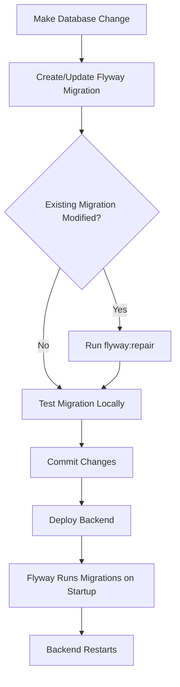
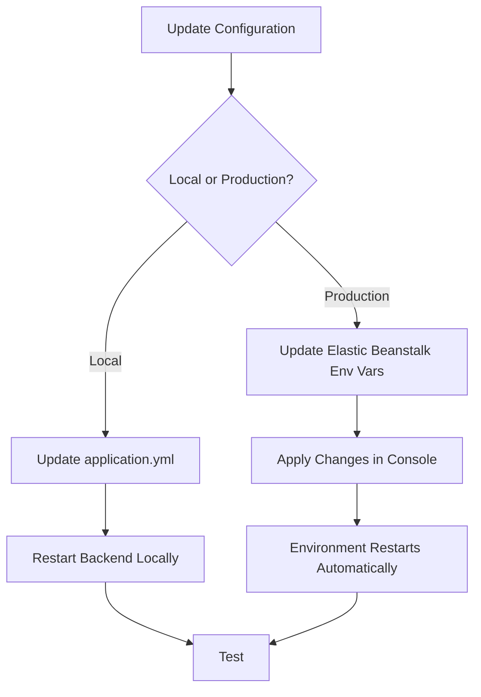

# Deployment Process Notes for Orchestrator

## Critical Deployment Workflow

### 1. Database Changes Require Flyway Migrations

**IMPORTANT**: Any database schema changes MUST be handled through Flyway migrations.

#### Process:
1. **Create Migration File**: Add SQL migration file in `backend/src/main/resources/db/migration/`
   - Format: `V{version}__{description}.sql` (e.g., `V13__add_new_column.sql`)
   - Version must be sequential and higher than existing migrations

2. **Test Locally**: 
   ```bash
   cd backend
   mvn flyway:migrate  # Test migration locally
   ```

3. **If Migration File Changes**: 
   - Flyway validates checksums - if you modify an existing migration file, you must repair:
   ```bash
   mvn flyway:repair -Dflyway.url=jdbc:postgresql://localhost:5432/invoiceme -Dflyway.user=postgres -Dflyway.password=postgres
   ```

4. **Backend Must Be Redeployed**: After any database change or migration update, backend must be restarted/redeployed for changes to take effect.

#### Example: Admin User Password Hash Update
- Modified: `V12__create_initial_admin_user.sql` (changed password hash)
- Required: `mvn flyway:repair` to update checksum
- Required: Backend restart to apply changes

---

### 2. JWT Secret Key Configuration

**IMPORTANT**: JWT secret key must be configured in multiple places for persistence.

#### Current Configuration:
- **Local Development**: `backend/src/main/resources/application.yml`
  - Default fallback: `3pQd3F32jrtNjrsreiPU3nG8bZ6y1P-rAfRPhyhhpbXS_8f995CDwBhqAcqUl-U8`
  - Format: `secret: ${JWT_SECRET:default_value}`

- **Production (Elastic Beanstalk)**: Environment variable `JWT_SECRET`
  - Must be set in: AWS Elastic Beanstalk Console → Configuration → Software → Environment properties
  - Current value: `3pQd3F32jrtNjrsreiPU3nG8bZ6y1P-rAfRPhyhhpbXS_8f995CDwBhqAcqUl-U8`
  - **MUST be 64+ characters (512+ bits) for HS512 algorithm**

#### Where to Update JWT_SECRET:

1. **Local Development** (`application.yml`):
   - Already updated with new secret as default fallback
   - Can override with environment variable: `export JWT_SECRET=your_secret`

2. **Production (Elastic Beanstalk)**:
   - **REQUIRED**: Update in AWS Console:
     - Go to: Elastic Beanstalk → Your Environment → Configuration → Software → Environment properties
     - Update `JWT_SECRET` to: `3pQd3F32jrtNjrsreiPU3nG8bZ6y1P-rAfRPhyhhpbXS_8f995CDwBhqAcqUl-U8`
     - Click **Apply** (triggers environment restart)

3. **Documentation Files** (for reference):
   - `ELASTIC_BEANSTALK_ENV_VALUES.txt` - ✅ Updated
   - `ELASTIC_BEANSTALK_ENV_VARS.md` - ✅ Updated

#### Why 64 Characters?
- HS512 algorithm requires **minimum 512 bits** (64 characters)
- Previous secret was 44 characters (352 bits) → caused `WeakKeyException`
- New secret: 64 characters (512 bits) → compliant with HS512

---

### 3. Complete Deployment Workflow

#### For Database Changes:



#### Steps:
1. **Create Migration**: `backend/src/main/resources/db/migration/V{N}__description.sql`
2. **If Modifying Existing**: Run `mvn flyway:repair`
3. **Test Locally**: `mvn spring-boot:run` (Flyway runs automatically)
4. **Commit & Push**: Git commit migration file
5. **Deploy**: Backend deployment triggers Flyway migration on startup
6. **Verify**: Check logs for migration success

#### For Configuration Changes (JWT_SECRET, etc.):



#### Steps:
1. **Update Configuration**:
   - Local: `application.yml` or environment variable
   - Production: Elastic Beanstalk Console → Environment properties
2. **Restart**:
   - Local: `mvn spring-boot:run`
   - Production: Click "Apply" in console (auto-restarts)
3. **Verify**: Test endpoint/functionality

---

### 4. Key Files to Update

#### Database Migrations:
- `backend/src/main/resources/db/migration/V{N}__*.sql`
- **Never modify** existing migration files after deployment (use new migrations instead)
- **If must modify**: Run `flyway:repair` after change

#### Configuration:
- **Local**: `backend/src/main/resources/application.yml`
- **Production**: AWS Elastic Beanstalk Console → Environment properties
- **Reference**: `ELASTIC_BEANSTALK_ENV_VALUES.txt`, `ELASTIC_BEANSTALK_ENV_VARS.md`

---

### 5. Important Notes for Orchestrator

1. **Database Changes = Migration + Redeploy**
   - Every database change requires a Flyway migration file
   - Backend must be redeployed after migration changes
   - Modified migrations require `flyway:repair`

2. **JWT Secret Must Be Updated in Production**
   - New secret: `3pQd3F32jrtNjrsreiPU3nG8bZ6y1P-rAfRPhyhhpbXS_8f995CDwBhqAcqUl-U8`
   - Must be 64+ characters for HS512 algorithm
   - Update in Elastic Beanstalk environment variables
   - Environment will restart automatically

3. **Configuration Persistence**
   - `application.yml` has defaults for local development
   - Production uses environment variables (override defaults)
   - Always update both local defaults AND production env vars when changing secrets

4. **Testing Workflow**
   - Test migrations locally first
   - Verify configuration changes locally
   - Then deploy to production

---

### 6. Current JWT Secret Status

- ✅ **Local (`application.yml`)**: Updated with new 64-character secret
- ⚠️ **Production (Elastic Beanstalk)**: **NEEDS UPDATE** - Still has old 44-character secret
- ✅ **Documentation**: Updated in `ELASTIC_BEANSTALK_ENV_VALUES.txt` and `ELASTIC_BEANSTALK_ENV_VARS.md`

**Action Required**: Update `JWT_SECRET` in Elastic Beanstalk Console to: `3pQd3F32jrtNjrsreiPU3nG8bZ6y1P-rAfRPhyhhpbXS_8f995CDwBhqAcqUl-U8`

---

## Summary for Orchestrator

**Database Changes**:
1. Create Flyway migration file
2. If modifying existing migration → run `flyway:repair`
3. Test locally
4. Commit and deploy backend
5. Flyway runs migrations on startup

**Configuration Changes (JWT_SECRET, etc.)**:
1. Update `application.yml` (local default)
2. Update Elastic Beanstalk environment variables (production)
3. Restart backend/environment
4. Verify changes

**Current JWT Secret**: `3pQd3F32jrtNjrsreiPU3nG8bZ6y1P-rAfRPhyhhpbXS_8f995CDwBhqAcqUl-U8` (64 chars, HS512 compliant)

